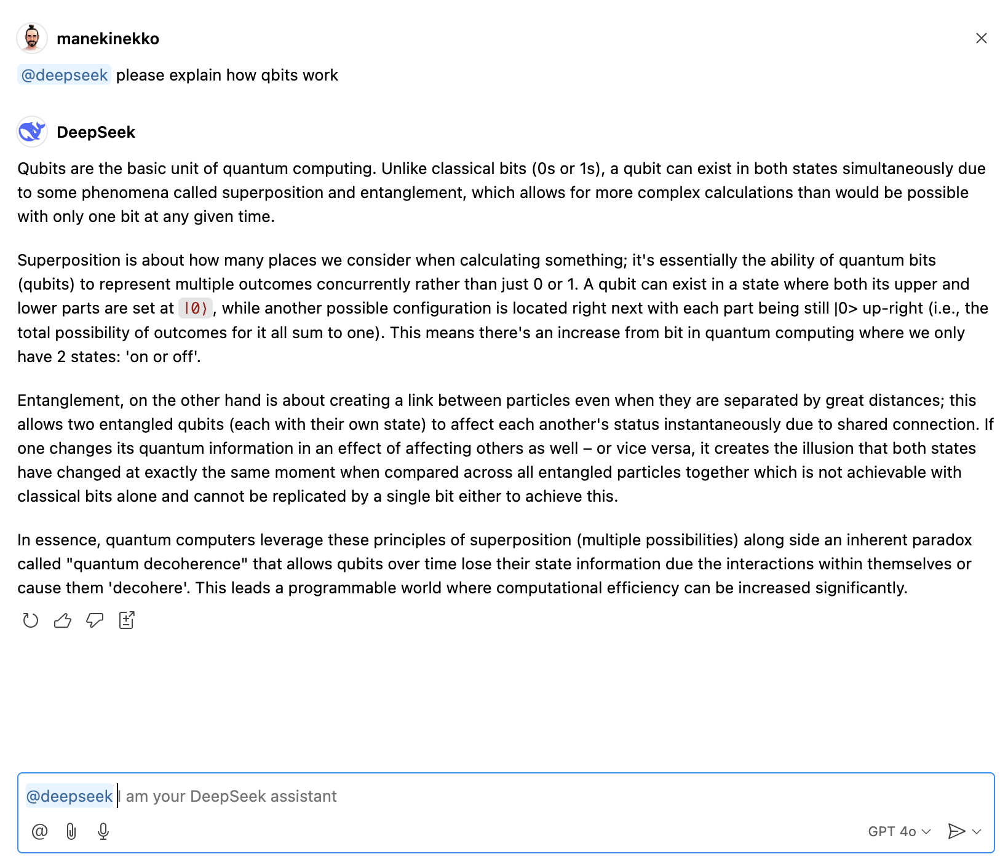

<p align="center">
<h1 align="center">DeepSeek Agent for Github Copilot</h1>
</p>
<p align="center">

</p>

<h3 align="center">
    <a href="https://marketplace.visualstudio.com/items?itemName=wassimdev.wassimdev-vscode-deepseek" alt="Marketplace version">
        
    </a>
    
    
</h3>

This extension allows you to interact with the DeepSeek models for Github Copilot Chat, fully locally and offline. It uses Ollama under the hood to provide a seamless experience.

## How to use

1. Install the extension from the Visual Studio Code Marketplace
2. Open Github Copilot Chat panel
3. In the chat, type `@deepseek` followed by your prompt



> [!NOTE] 
> During the first run, the extension will download the model. This may take a few minutes.

## Build from source

1. Clone this repository
2. Run `npm install`
3. Run `npm run package`
4. Install the generated `.vsix` file in Visual Studio Code

## Settings

You can configure the extension by opening the settings panel (or `settings.json`) and editing the following settings:

```json

{
    "deepseek.model.name": "deepseek-coder:1.3b",
}
```

> [!NOTE] 
> You can find a list of available DeepSeek models at [ollama.com](https://ollama.com/search?q=deepseek).

## Limitations

Currently, the extension does not have access to your files, so it cannot provide context-aware completions. This will be fixed in future versions.

To remedy this, you can copy the code you want to complete and paste it in the chat.

## Requirements

This extension requires the Ollama app to be installed on your system. You can install it by following the instructions from [ollama.com](https://ollama.com/).

